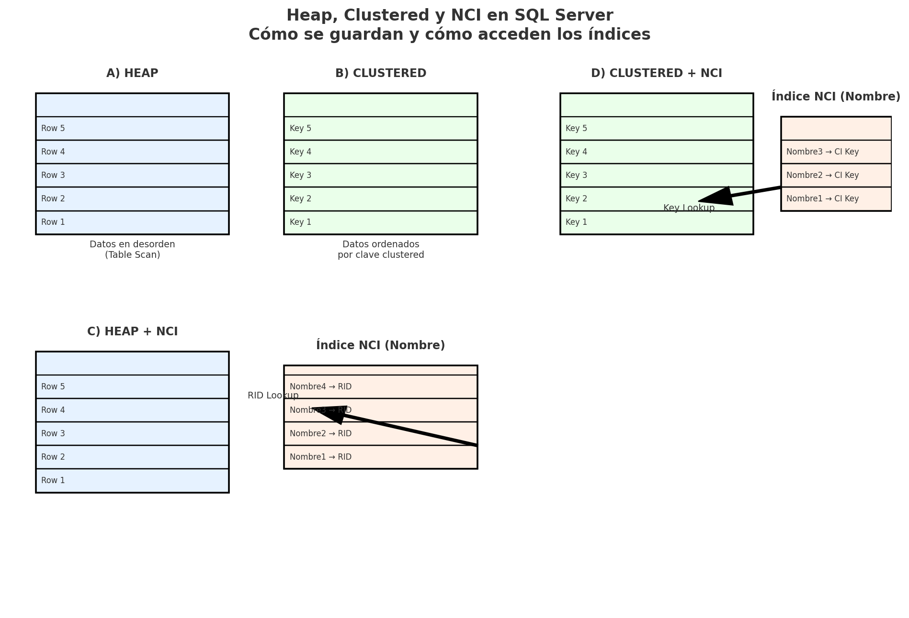

# 📘 README — Heap, Clustered, Non-Clustered Index y combinaciones en SQL Server

Piensa en 2 cosas claves:  
1. **Cómo están guardados los datos en disco** → Heap o Clustered.  
2. **Cómo se accede a ellos con índices no clusterizados (NCI)** o sin ellos.  

---

## 📊 Gráfico visual


---

## 🔹 Caso 1: HEAP (sin índices)
- **Definición**: tabla sin índice clustered.  
- **Datos**: en desorden, tal como se insertan.  
- **Acceso**:  
  - Si consultas por columna sin índice → **Table Scan** (revisa toda la tabla).  
  - Si agregas un NCI, ese índice apunta al **RID (Row ID)** de la fila en el heap.  

👉 **Ejemplo**:
```sql
CREATE TABLE ClientesHeap (
  Id INT IDENTITY(1,1),
  Nombre NVARCHAR(100)
); -- sin índice clustered → heap

-- Consulta por Nombre sin índice
SELECT * FROM ClientesHeap WHERE Nombre='Juan';
-- Plan: Table Scan
```

---

## 🔹 Caso 2: CLUSTERED INDEX (solo clustered, sin NCI)
- **Definición**: la tabla está físicamente ordenada por la clave clustered.  
- **Acceso**:  
  - Si consultas por la clave → **Clustered Index Seek** (rápido).  
  - Si consultas por otra columna → **Clustered Index Scan** (revisa todo porque no hay NCI).  

👉 **Ejemplo**:
```sql
CREATE TABLE ClientesCI (
  Id INT IDENTITY(1,1) PRIMARY KEY CLUSTERED,
  Nombre NVARCHAR(100)
);

-- Consulta por clave (Seek)
SELECT * FROM ClientesCI WHERE Id=500;

-- Consulta por otra columna (Scan)
SELECT * FROM ClientesCI WHERE Nombre='Juan';
```

---

## 🔹 Caso 3: HEAP + Non-Clustered Index
- **Datos**: siguen desordenados (heap).  
- **NCI**: guarda la clave del índice + un puntero al **RID (Row ID = File:Page:Slot)**.  
- **Acceso**:  
  - Consulta por columna con índice NCI → **Index Seek** en el NCI.  
  - Si pides más columnas que no están en el NCI → **RID Lookup** (va al heap a traer las columnas faltantes).  
  - Si usas `INCLUDE(...)` en el NCI, se convierte en índice de **cobertura** y evita el lookup.  

👉 **Ejemplo**:
```sql
CREATE NONCLUSTERED INDEX IX_ClientesHeap_Nombre
ON ClientesHeap(Nombre);

-- Consulta
SELECT * FROM ClientesHeap WHERE Nombre='Juan';
-- Plan: Index Seek + RID Lookup

-- Solución con cobertura
CREATE NONCLUSTERED INDEX IX_ClientesHeap_Nombre_Cover
ON ClientesHeap(Nombre) INCLUDE(Id);
```

---

## 🔹 Caso 4: CLUSTERED + Non-Clustered Index
- **Datos**: ordenados por la clave clustered.  
- **NCI**: guarda la clave del índice + un puntero a la **clave clustered** (no al RID).  
- **Acceso**:  
  - Consulta por columna con NCI → **Index Seek**.  
  - Si faltan columnas → **Key Lookup** (usa la clave clustered para buscar la fila completa).  
  - Si el NCI es de cobertura, no hay lookup.  

👉 **Ejemplo**:
```sql
CREATE NONCLUSTERED INDEX IX_ClientesCI_Nombre
ON ClientesCI(Nombre);

-- Consulta
SELECT * FROM ClientesCI WHERE Nombre='Juan';
-- Plan: Index Seek + Key Lookup

-- Evitar lookup
CREATE NONCLUSTERED INDEX IX_ClientesCI_Nombre_Cover
ON ClientesCI(Nombre) INCLUDE(Id);
```

---

## 🔍 Comparación resumida

| Caso                   | Datos físicos     | NCI apunta a…     | Búsqueda sin índice        | Búsqueda con NCI | Lookup                     |
|------------------------|------------------|------------------|----------------------------|------------------|----------------------------|
| **Heap**               | Desordenado      | N/A              | Table Scan                 | N/A              | N/A                        |
| **Clustered solo**     | Ordenado por clave | N/A            | Clustered Index Scan       | N/A              | N/A                        |
| **Heap + NCI**         | Desordenado      | RID              | Table Scan                 | Index Seek       | RID Lookup (si faltan col.)|
| **Clustered + NCI**    | Ordenado por clave | Clave clustered| Clustered Index Scan       | Index Seek       | Key Lookup (si faltan col.)|

---

## 🧠 Idea intuitiva
- **Heap** = caja de papeles en desorden → solo puedes revisar todos para encontrar algo.  
- **Clustered** = diccionario ordenado → puedes ir directo a la palabra.  
- **NCI en heap** = índice externo con apuntadores (RID) → encuentra rápido, pero luego busca en la caja (**RID Lookup**).  
- **NCI en clustered** = índice externo con apuntadores a la clave clustered → encuentra rápido, pero luego va al diccionario (**Key Lookup**).  
